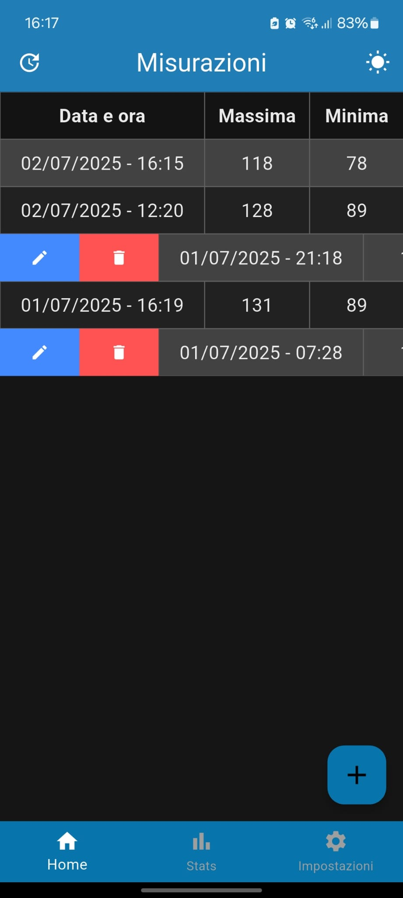
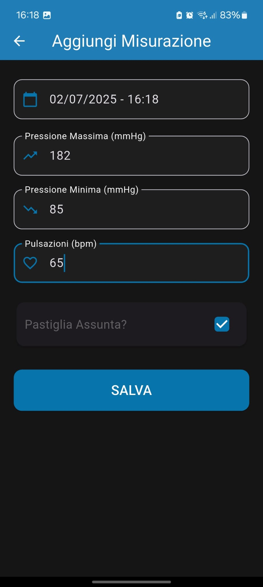
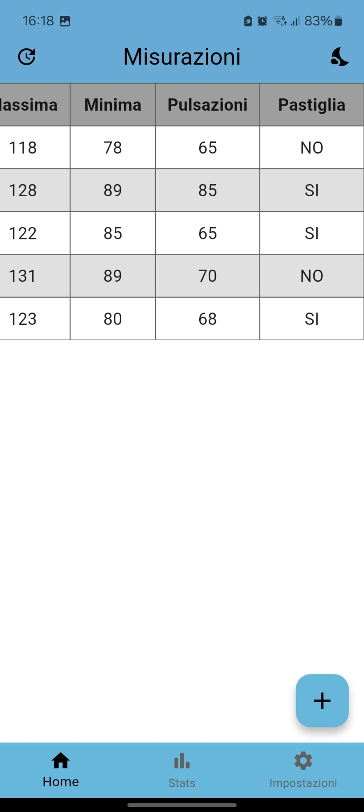

# Mercury
Mercury è una applicazione open source per telefono dedicata a tracciare, conservare e analizzare le misurazioni di pressione sanguigna.

# Screenshot

  
  
  

# Changelog
Partendo dalla più recente versione ecco tutto il changelog. I relativi file APK si trovano nella loro cartella dedicata.
## 2.0.0 - 02/07/2025
- La seconda edizione dell'applicazione. 
- Tutta l'applicazione è stata ricostruita con il framework Flutter.
- L'interfaccia è cambiata radicalmente rispetto alla versione precedente.
- Sono stati inseriti i temi chiaro/scuro.
- Implementate funzionalità di modifica e di elimina.
- Form per inserire i dati migliorato tramite Date Picker. 
- Inserito comando per cancellare tutti i dati dal database.
- Inserito comando per condividere il file csv con i dati delle misurazioni. 
## 1.0.0 - 20/04/2025
- La prima versione ufficiale dell'applicazione.
- Il tasto "Esporta CSV" è ora funzionante.
- Le colonne della tabella nella scheramta home sono state allargate.
## 0.0.1 - 19/04/2025
- Questa è la beta dell'applicazione. Funziona tutto tranne il tasto "Esporta CSV", che è stato programmato male e fa crashare l'applicazione. Può comunque essere usata come prova.
## 0.0.0 - 17/04/2025
- L'applicazione è ancora in fase di sviluppo.
